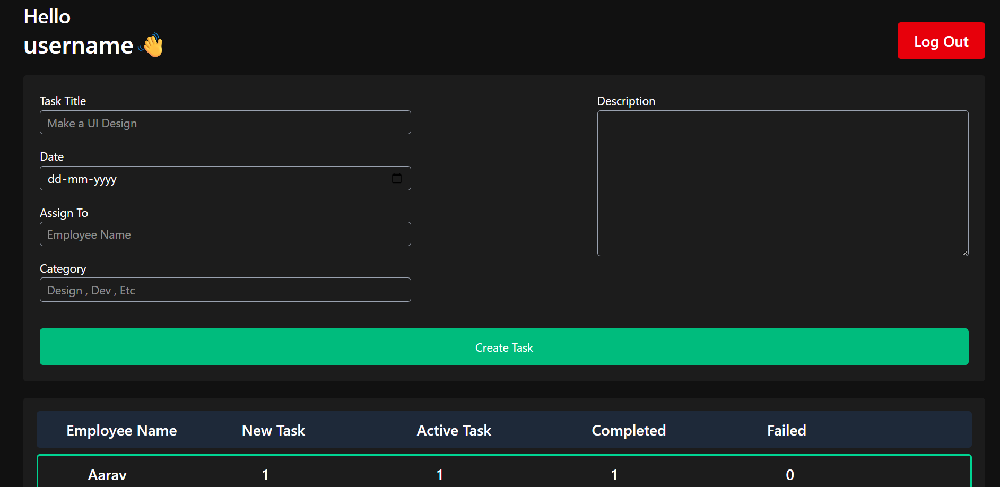
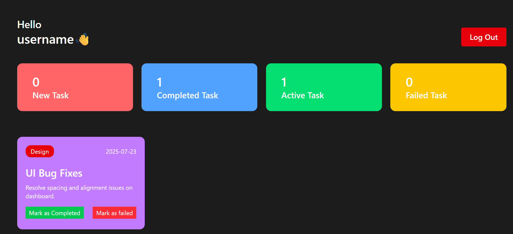

# Employee Management System 🧑‍💼

A full-stack web application enabling CRUD operations for employee data — add, view, edit, and remove employee records — built for learning or organizational use.

# Screenshots





## 🔥 Features

- ✅ Add new employees with personal and job details  
- ✅ View a list of employees with search and pagination  
- ✅ Update/edit employee information  
- ✅ Delete employee records  
- ✅ Centralized workflow and dashboard  

## 🚀 Installation & Setup

```bash
# Clone the repository
git clone https://github.com/gauravchauhan26/Employee-Management-System.git

# Navigate into the project folder
cd Employee-Management-System

# Install dependencies
npm install

# Start the development server
npm start
